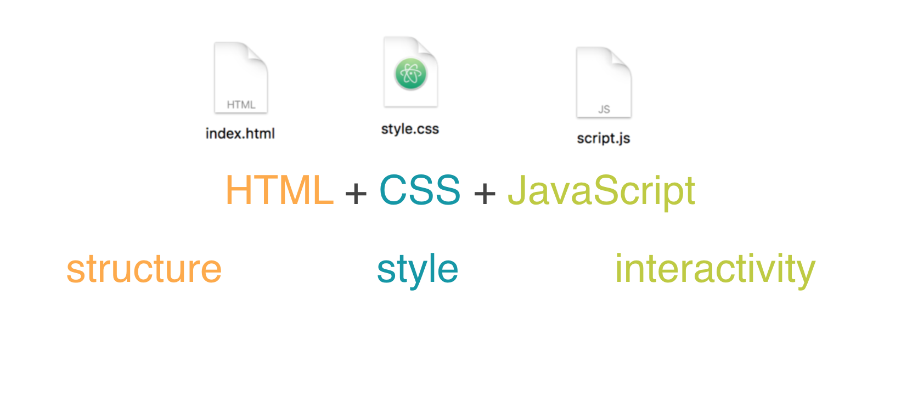

# First Things First
### Showcase
- [irina0802.github.io/day-1/](http://irina0802.github.io/day-1/)
- [vithyasrikumar.github.io/day-1/](http://vithyasrikumar.github.io/day-1/)
- [riyakoshy.github.io/day-1/](http://riyakoshy.github.io/day-1/)
- [ashabooga.github.io/day-1/](http://ashabooga.github.io/day-1/)

### Reminder The 3 Steps of updating your Git repository
1. `git add .`
2. `git commit -m "this is a descriptive commit message"`
3. `git push origin master`

### Asking for Help
1. Ask Google
2. Ask your neighbor
3. Ask Nabil or Sean

### Clone into this repository
In your terminal, in your `code-forward` directory:

``git clone https://github.com/code-forward/day-2.git`` 

# Introduction to JavaScript
JavaScript is the programming language of the web. Although it's capable of so much more, today we'll focus on how it can be used to add interactivity to your webpages.




There are multiple ways to do this, but for now, we'll link Javascript files to our webpages by like this:

```HTML
<!doctype html>
<html>
  <head>
    <title></title>
    <link rel="stylesheet" href="style.css">
  </head>
  <body>
    <div>
      <h1>Hello, Gakko!</h1>
      <p></p>
    </div>
    <script type="text/javascript" src="script.js"></script>
  </body>
</html>
```
This way, since `<script></script>` is at the bottom of the `<body></body>`, all the content of the webpage will be loaded *before* we run our JavaScript program.

## But first let's see what JavaScript can do. 
Open your Chrome Developer Tools and find the Console. Run a few of these commands.

### It can make alerts
```javascript
alert("NOOOOO!!!!");
```

### It can print words on the Console
```javascript
console.log("Hello, world!");
```

### It can do math
```javascript
1 + 2 + 3 + 5 + 8 + 13 + 21 + 34
```

### It can modify content
```javascript
document.querySelector('body').textContent = "New Title";
```

We're pretty much telling the browser, "Hey, `document`! Select an `h1`, and change its text to say 'New Title'."

See if you can change the title of the [New York Times food section](https://www.nytimes.com/section/food?WT.nav=page&action=click&contentCollection=Food&module=HPMiniNav&pgtype=Homepage&region=TopBar).

You'll need to relaunch Developer Tools for this specific webpage.

###  It can change styles
In other words, we can write CSS with JavaScript!

```javascript
document.querySelector('div').style.background = "red";
```

We're telling the browser, "Hey, `document`! Select a `div`, and change its `style` (its CSS) so its `background` property is `red`."


>Important note: JavaScript syntax is slightly different from CSS. For example:

>```CSS
>body {
>	text-transform: uppercase; 
>}
>``` 

> accomplishes the same thing as 

>```Javascript
>document.querySelector('body').style.textTransform = "uppercase";
>```
> The key difference is `text-transform` in CSS vs `textTransform` in JS


